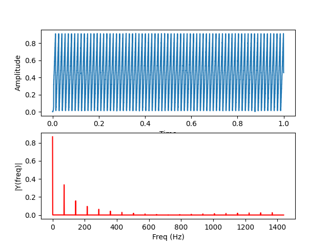
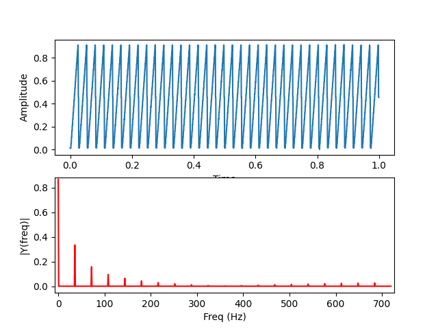
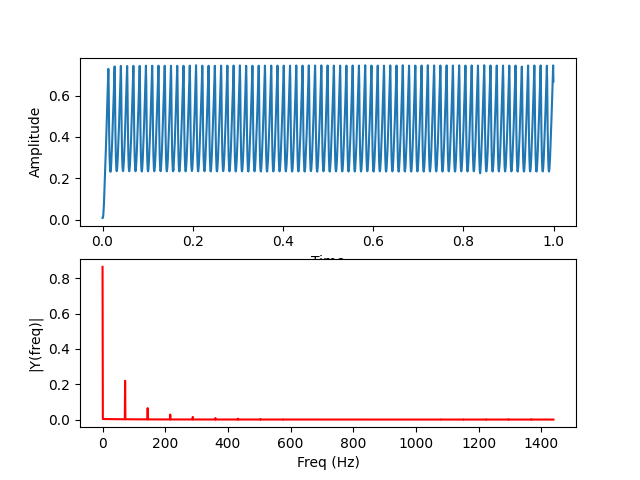
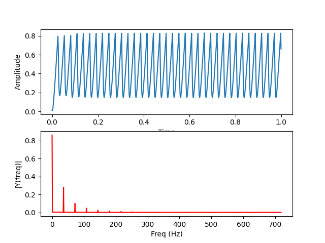

# hw2

## How to set up and run my program
1. Compile the program
```
$ sudo mbed compile --source . --source ~/ee2405/mbed-os-build/ -m B_L4S5I_IOT01A -t GCC_ARM -f
```
2. Excute FFT.py 
```
$ sudo python3 FFT.py
```
3. Use button to choose  frequency of triangle signal.
4. Push 'sel button' to start genatare and sample the wave.
5. Get output result.

## Result

### Cutoff frequency
<a href="https://www.codecogs.com/eqnedit.php?latex=f_{c}&space;=&space;\frac{1}{2\pi&space;\times&space;4.7&space;\times&space;10^3&space;\times&space;47&space;\times&space;10^{-9}}&space;=&space;72.04&space;Hz" target="_blank"></a>
### Frequency response and wave diagram
|   |72Hz|36Hz|
|:-:|:-:|:-:|
|**before RC**|||
|**after RC**|||
#### before RC V.S. after RC
High frequency signals become smaller or decrease to zero after the RC filter.

#### 72Hz after RC V.S. 36Hz after RC
The main ferquency of 72Hz decrease more than 36Hz's after the RC filte. The cutoff frequency of this RC filter is 72Hz, so signals with frequecy 72Hz decrease more than 32Hz.
